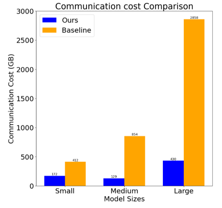
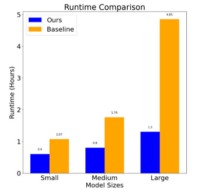
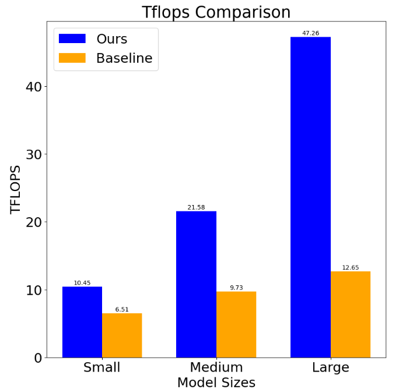

# Setting Up the ColossalAI Codebase

This guide will walk you through the process of setting up the ColossalAI codebase on your system.

## Prerequisites

- Conda
- CUDA 11.7
- Git
- Pip

## Steps

1. **Create a new conda environment with Python 3.9**

    Open a terminal and run the following commands:

    ```bash
    conda create -n colossal_new python=3.9
    conda activate colossal_new
    ```

2. **Set up CUDA 11.7 as the main CUDA**

    If you don't have CUDA 11.7 installed, you can download and install it with the following commands:

    ```bash
    wget https://developer.download.nvidia.com/compute/cuda/11.7.0/local_installers/cuda_11.7.0_515.43.04_linux.run
    sudo sh cuda_11.7.0_515.43.04_linux.run
    ```
	Accept EULA and tick only CUDA toolkit, select NO as for symlink already exists.
    Then, add CUDA 11.7 to your PATH and LD_LIBRARY_PATH with these commands:

    ```bash
    export PATH="/usr/local/cuda-11.7/bin:$PATH"
    export LD_LIBRARY_PATH="/usr/local/cuda-11.7/lib64:$LD_LIBRARY_PATH"
    ```

3. **Clone the ColossalAI repository**

    You can clone our repository with this command:

    ```bash
    git clone https://github.com/durvesh8/HeteroPipe.git
    ```

4. **Install the ColossalAI package**

    Navigate to the ColossalAI directory and install the package with this command:

    ```bash
    cd HeteroPipe/ColossalAI
    CUDA_EXT=1 pip install .
    ```

5. **Install additional Python packages**

    You can install the additional required Python packages with these commands:

    ```bash
    pip install transformers
    pip install titans
    ```
6. **Into the GPT codebase**
    The GPT training code is in here.

    ```bash
    cd examples/language/gpt/titans
    ```
7. **Webtext dataset**
    You can download the preprocessed sample dataset for this demo via our [Google Drive sharing link](https://drive.google.com/file/d/1QTCS_etZr3BTvL_mUwI47rFpHLDB32sk/view?usp=drive_link) and place it in this directory or you can use dummy dataset.

8. **Commands to run**
   
    #### Run on a single node
    ```bash
    colossalai run --nproc_per_node=<num_gpus> train_gpt.py --config configs/<config_file> --from_torch --use_dummy_dataset
    ```
    #### Run on a multiple nodes (run from each terminal)
    You need to ensure that environment is setup properly using the above steps, data is in place and files are same across all nodes.
    ```bash
    torchrun --nproc_per_node=<num_gpus> --nnodes=<num_nodes> --node_rank=<specify_node_rank> --master_addr=<MASTER_ADDR> --master_port <MASTER_PORT> train_gpt.py --config configs/gpt3_zero3_pp1d.py --from_torch --use_dummy_dataset
    ```
    - Node Ranks start from 0.
    - Master Address can be any node's IP: 100.100.100.20
      
    #### Run on a multiple nodes (run from master terminal)
    ```bash
    colossalai run --nproc_per_node YOUR_GPU_PER_NODE --hostfile YOUR_HOST_FILE \
    --master_addr YOUR_MASTER_ADDR train_gpt.py --config configs/gpt3_zero3_pp1d.py --from_torch --use_dummy_dataset
    ```

    - To be able to run the training of GPT-3 in a custom manner, change the experimentvar to True in configs/gpt3_zero_pp1d.py. Then, change the dpranksvar and ppranksvar to your choice.
    - Given 3 nodes with 4 GPUs each, (for a pipeline size 4)
    - An inefficient setting (default): ppranks = [[0,1,2,3],[4,5,6,7],[8,9,10,11]]. dpranks = [[0,4,8],[1,5,9],[2,6,10],[3,7,11]] (Here, Stage A,B,c,D are on 0,1,2,3 respectively as well as 4,5,6,7 (A,B,C,D) with 3 such pipelines connected in data parallel.)
    - An efficient setting with pipeline size 3: ppranks: [[0,4,8],[1,5,9],[2,6,10],[3,7,11]], dpranks: [[0,1,2,3],[4,5,6,7],[8,9,10,11]]. (Here, Stage A,B,C are on 0,4,8 respectively as well as 1,5,9 (A,B,C) with 4 such pipelines connected in data parallel.)

    Here is a sample hostfile:

    ```text
    hostname1
    hostname2
    hostname3
    hostname4
    ```

    Make sure master node can access all nodes (including itself) by ssh without password and that environment is setup on each node and even the environment name is same, code is consistent across all these nodes.
   
    #### Using webtext
    To use webtext remove "use_dummy_dataset" and run
    ```bash
    export DATA="PATH_TO_YOUR_DATA"
    ```
    


## Results

Our modificaiton to ColossalAI framework provides significant improvements across various performance metrics. Below are the three graphs that illustrate the enhancement in the following areas:

1. **Improvement in TFLOPS**: This graph shows the increase in tera-floating point operations per second (TFLOPS) achieved using our approach compared to their baseline.

2. **Reduction in Runtime**: A comparison between original ColossalAI and our implementation, highlighting the reduced time needed for the same computations.

3. **Drop in Communication**: Illustration of how our approach minimizes inter-node communication overhead, leading to more efficient parallel processing.





